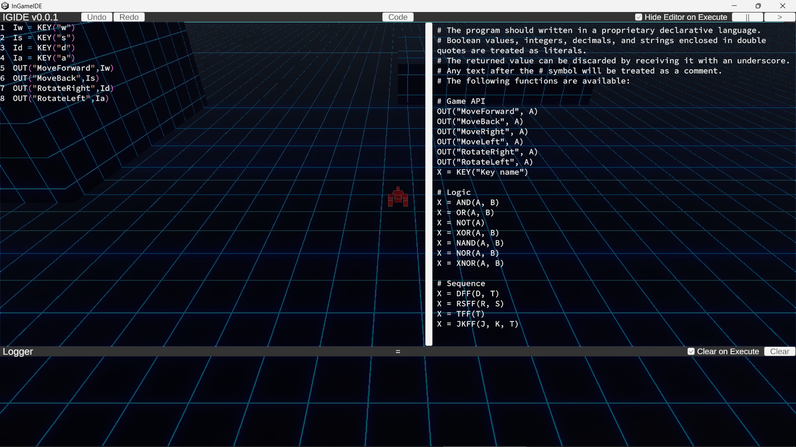

# InGameIDE

## Overview

独自の宣言型言語によるゲーム内プログラミング機能のサンプルプロジェクトです。  
使用できる関数などはゲーム内に記載しています。

Unity 2023.2.22f1 (URP)  
InputSystem 1.7.0  
UniRx 7.1.0  
VContainer 1.17.0  

⚠このリポジトリはサンプルプロジェクトです。**ライブラリではありません**。  
既存のプロジェクトに追加すると予期せぬファイルの上書きが発生する可能性があります。

## How to Use

1. このリポジトリをクローンします。
2. Unity 2023.2.22f1以降でクローンしたプロジェクトを開きます。
3. メニューバーから`Window → TextMeshPro → Import TMP Essential Resources`を選択し、TMP Essential Resourcesをインポートします。
4. `Assets/Scenes/MainScene`を開きます。

## Fonts

This project includes Source Code Pro.

Copyright 2010, 2012 Adobe Systems Incorporated.

Licensed under the SIL Open Font License 1.1.
See `assets/Fonts/OFL.txt`.